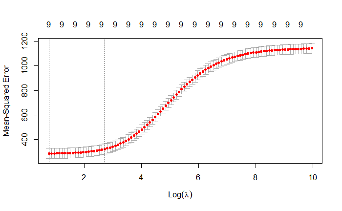
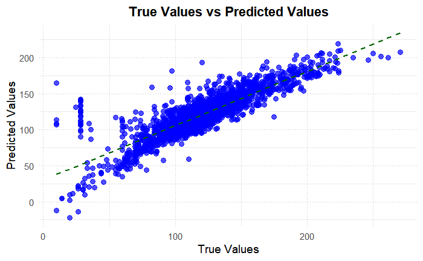
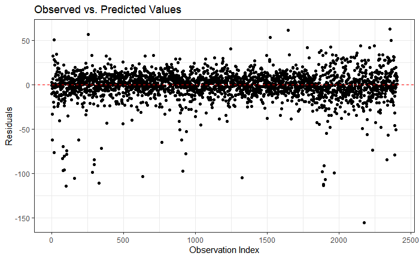

# 🚗 BMW Price Prediction: Advanced Statistical Modeling

## The Challenge
B2B auction platforms needed accurate pricing models for used BMW vehicles to optimize bidding strategies. Using data from **4,843 BMW cars sold in 2018**, the challenge was to identify which vehicle features, mileage patterns, and market timing factors most significantly impact auction prices.

## Approach
**Strategy:** Built and compared multiple regression approaches, ultimately developing a Ridge regression model with a square-root price transformation for optimal performance.

**Key Technical Innovation:** Applied regularization with cross-validated λ tuning, preventing overfitting while retaining all predictive features.

## Results That Matter
- **R² = 0.74 (74% variance explained)** vs 0.63 from baseline regression  
- **RMSE = 16.8** (vs 20.5 baseline)  
- **MAPE = 13.8%** — industry-competitive pricing precision  
- **Insights:** Mileage strongly decreases price, while engine power increases it; certain equipment features provide additional value.  

| Model Comparison | R² | RMSE | MAPE |
|------------------|----|------|------|
| Baseline Regression | 0.63 | 20.5 | 18.4% |
| **Ridge Regression** | **0.74** | **16.8** | **13.8%** |

## Business Impact
This improvement enables dealers to:  
- **Price inventory** 25% more precisely (13.8% vs 18.4% error rate)  
- **Reduce** time-to-sale through optimized market positioning  
- **Increase** profit margins with data-driven pricing strategies  

## Technical Implementation
- **Tools:** R (glmnet, caret, ggplot2), cross-validation, statistical modeling  
- **Data:** 4,843 auction records, 15+ vehicle features  
- **Scale:** Comprehensive analysis across fuel types, car categories, and equipment packages  

### Model Validation
  
  

**[📄 View Full Analysis & Code →](assets/bmw/Final_Report_C2G3.pdf)**
