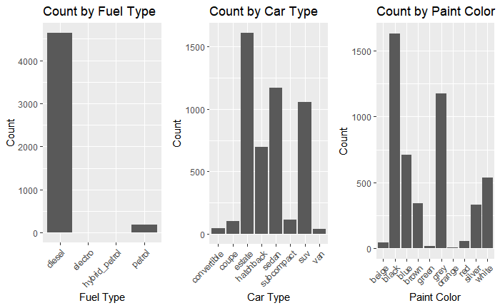
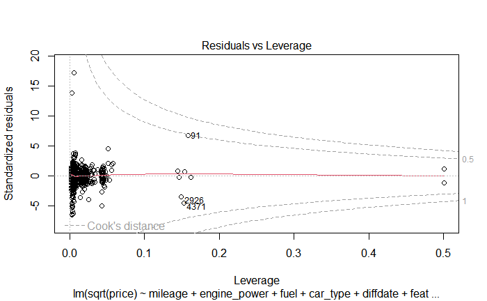

# 🚗 Optimizing Used BMW Pricing: A Predictive Analysis  

A statistical learning and predictive modeling project in **R**, analyzing auction prices of used BMW cars.  
This work was completed as part of a team project (Lab Section C3G2) with **Mi-Ru Youn, Zhikun Wen, Zijie Zhou, Hitaishi Hitaishi, and Yunbae Lim**.

---

## 📂 Dataset  
- **Source:** 4,843 BMW used cars sold at B2B auctions (2018).  
- **Target Variable:** Auction price (highest bid).  
- **Features:**  
  - **Numerical:** Mileage, Engine Power, Registration/Sale Date Difference.  
  - **Categorical:** Fuel Type, Car Type, Paint Color, and 8 equipment features.  

**Preprocessing Steps:**  
- Removed unrealistic values (e.g., negative mileage, zero engine power).  
- Handled missing values, transformed skewed distributions.  
- Derived new variable: `diffdate` (days between registration and sale).  

---

## 📊 Exploratory Analysis  

- **Distributions**  
  Mileage and engine power strongly influenced price, with long-tailed distributions.  
    

- **Categorical Variables**  
  Fuel type and car type shaped price variation.  
    

---

## 🤖 Modeling Approaches  

Implemented in **R** using `lm`, `glmnet`, and `caret` packages.  

- **Baseline Multiple Linear Regression**  
  Adjusted R²: **0.63**. Mileage, engine power, and car type significant.  

- **Reduced Model & Stepwise Regression**  
  Simplified variable set retained similar performance.  

- **Transformation**  
  Square-root of price improved linearity and homoscedasticity.  

- **Ridge Regression (Best Model)**  
  Used cross-validation to tune λ.  
  R²: **0.75**, Adjusted R²: **0.75**, RMSE: **16.84**.  
    

---

## 📈 Results & Diagnostics  

- **Model Fit**  
  Predicted vs. actual values show strong alignment (R² ≈ 0.74).  
    

- **Residuals Check**  
  Residuals vs. fitted plot confirmed no major bias; variance stable across fitted values.  
    

- **Variable Importance**  
  Mileage (↓) and engine power (↑) dominated price effects; fuel and car type added smaller but significant contributions.  
    

- **Performance Metrics (Validation Set):**  
  | Model                | R²   | RMSE  | MAE   | MAPE   |  
  |----------------------|------|-------|-------|--------|  
  | Multiple Regression  | 0.63 | 20.5  | 13.8  | 18.4%  |  
  | Stepwise Regression  | 0.63 | 20.2  | 13.6  | 18.1%  |  
  | **Ridge Regression** | **0.74** | **16.8** | **10.7** | **13.8%** |  

---

## 🌟 Takeaways  

- Mileage and engine power are the **primary drivers** of BMW resale value.  
- Seasonal demand significantly impacts pricing.  
- Ridge regression provided the **most stable and accurate model**, addressing multicollinearity.  
- Limitations: luxury outliers poorly predicted; some missing equipment feature definitions reduced interpretability.  

---

## 📄 Full Report  

For full methodology, complete diagnostics, and additional plots:  
💻 [GitHub Repository](https://github.com/miruyoun/BMW_Price_Analysis)  
[📕 Read Full Report (PDF)](assets/bmw/Final_Report_C2G3.pdf)  

---
