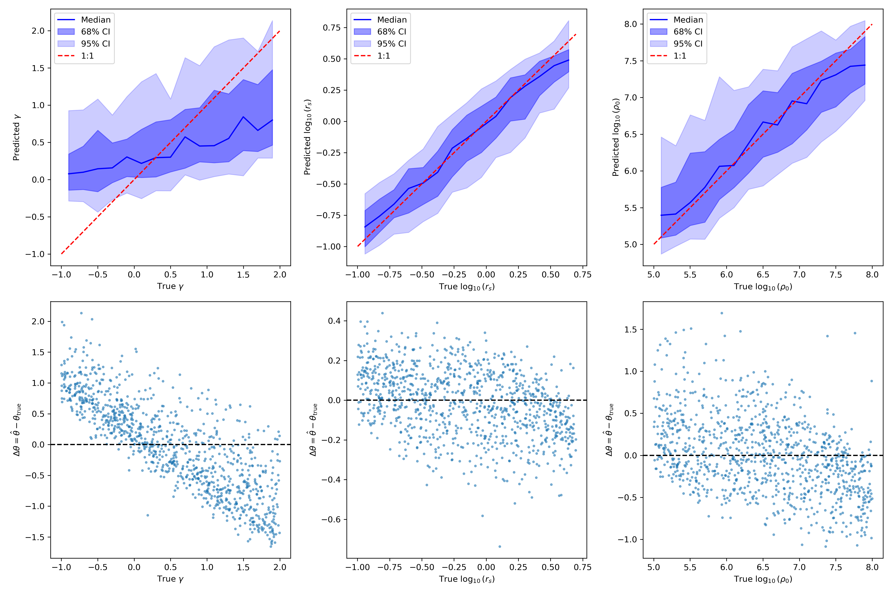
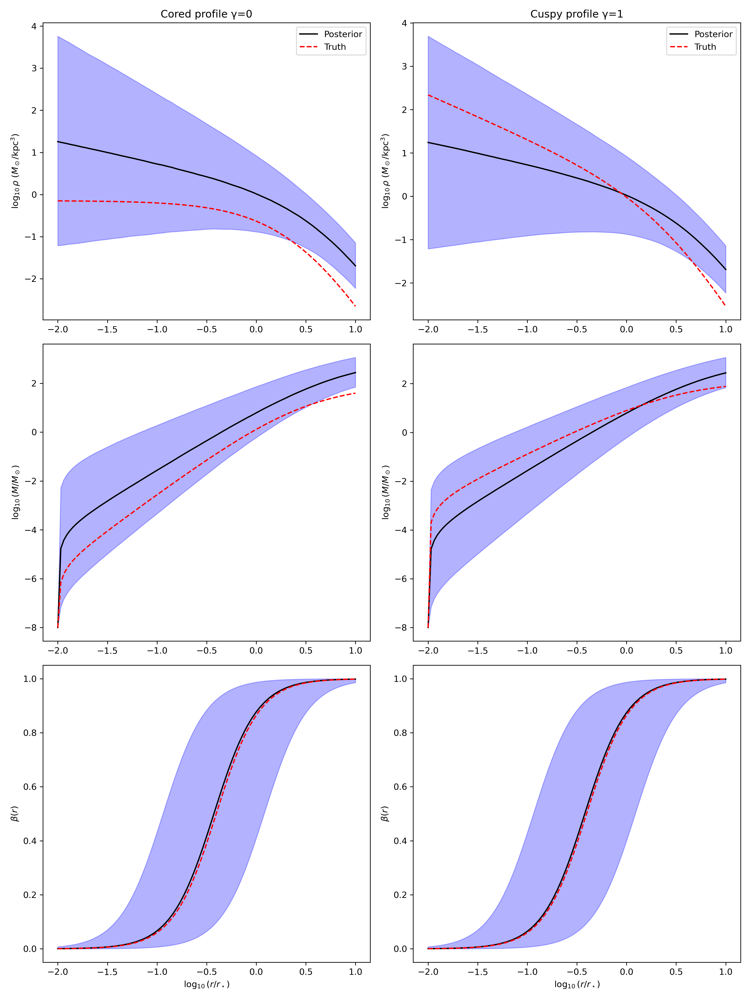
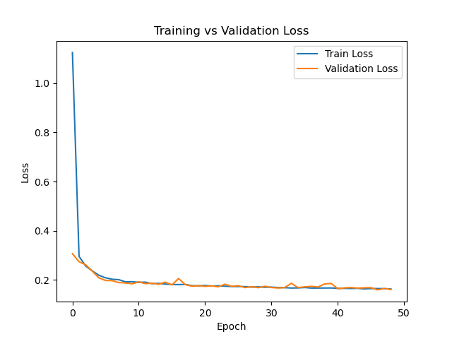

# Reproducing GNN-based Inference of Dark Matter Density Profiles

This project reproduces Nguyen et al.’s **graph neural network (GNN)** pipeline for inferring dark matter density in dwarf galaxies. We implemented both a scratch PyTorch GCN and a PyTorch Geometric version with normalizing flows.

---

## 🚀 Highlights
- Built two pipelines:
  - **Scratch GCN** → two-layer GCNConv + global pooling.  
  - **PyTorch Geometric GNN + Normalizing Flow** → ChebConv backbone + MAF flow.  
- Recreated **Figures 1–3** from the original paper.  
- Benchmarked against **classical Jeans analysis**.  

---

## 📊 Key Results
- **Figure 1:** Parameter recovery with scratch GCN — strong fits for ρ₀ and rₛ, weaker for γ.  
- **Figure 2:** Posterior inference via normalizing flows — credible bands captured cored vs cuspy halos.  
- **Figure 3:** Jeans analysis comparison — GNN reduced RMSE errors by ~2× vs classical baseline.  
- RMSE across 10k test galaxies:  
  - γ: 0.18 (vs 0.35 with Jeans)  
  - log rₛ: 0.12 (vs 0.22)  
  - log ρ₀: 0.15 (vs 0.28)  

---

## 📂 Dataset
- Generated with **StarSampler**.  
- Priors:  
  - log₁₀ ρ₀ ∼ U(5, 8)  
  - log₁₀ rₛ ∼ U(log₁₀ 0.1, log₁₀ 5)  
  - γ ∼ U(–1, 2)  
- 80k train, 10k val, 10k test galaxies.  

---

## 🌟 Impact
Demonstrated that GNNs + flows outperform traditional Jeans modeling in accuracy and uncertainty calibration, highlighting the promise of ML in astrophysics.

---

## 🔗 Links
- 💻 [GitHub Repository](https://github.com/ryanice4hire/DS542-Final)  
- 📄 [Read Full Paper (PDF)](assets/DarkMatterGCN_Paper.pdf)  

---

## 🖼️ Figures
  
  
  
  

---
