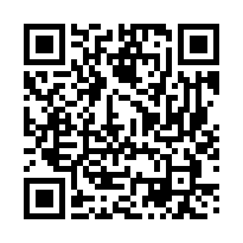

# Mi-Ru Youn  
**Data Science Master's Student at Boston University**  

<!-- Profile picture -->

  

Welcome to my portfolio! Here I showcase selected projects in fields of machine learning, statistics, and data analysis.  

<!-- Resume link -->

  <a href="assets/Miru_Youn_Resume.pdf" target="_blank" class="press-btn">📄 View Resume</a>

<!-- QR code -->

  

---

## 📂 Projects
- [Relaxed QMIX for Multi-Agent Reinforcement Learning](relaxedqmix.md)
- [Boston Bus Equity Analysis (GBH and BU Spark! Collaboration)](mbta.md)
- [BMW Price Analysis](mbta.md)
- [Graph Neural Networks for Dark Matter Inference](darkmatter.md)

## 📫 Contact
- [LinkedIn](https://linkedin.com/in/miruayoun)  
- [GitHub](https://github.com/miruyoun)  
