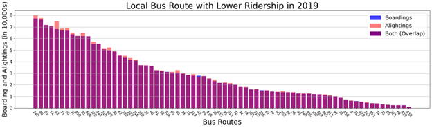
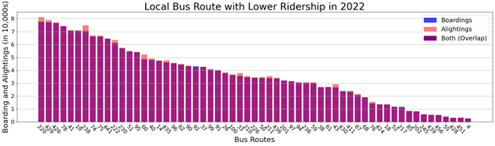

# GBH Impact & Equity: Boston Bus Equity

A data-driven analysis of **MBTA bus ridership, delays, and equity impacts** across Boston (2019–2023). This project was completed in collaboration with **GBH** and **BU Spark!**.

---

## 🚀 Highlights
- Compared ridership trends pre- vs post-COVID.  
- Analyzed travel times, delays, and reliability across key routes.  
- Assessed service disparities for **Environmental Justice communities**.  

> ### ℹ️ What Are Environmental Justice (EJ) Neighborhoods?  
> In Massachusetts, **Environmental Justice (EJ) neighborhoods** are census block groups where residents are more likely to face disproportionate burdens from environmental or infrastructure decisions.  
>  
> A neighborhood is officially designated as EJ if it meets **one or more** of these criteria:  
> - Median household income ≤ **65%** of the statewide median.  
> - Population is ≥ **40% minority**.  
> - ≥ **25% of households** lack an adult fluent in English.  
>  
> Many Boston neighborhoods — including **Dorchester, Roxbury, Mattapan, and East Boston** — are classified as EJ communities. Because these areas often **rely more heavily on public transit**, service delays and inequities in MBTA operations have a disproportionate impact on residents’ daily lives.
---

## 📊 Key Results
- **Ridership Trends**  
  Sharp drop in 2020 during COVID, recovery surpassing pre-pandemic levels by 2023.  

    

- **Local Bus Routes**  
  2019 had significantly higher ridership; recovery uneven by 2022.  

    
    

- **Express & Crosstown Routes**  
  Express routes showed increased ridership post-pandemic, while crosstown routes declined.  

    
    

- **Equity Findings**  
  Routes with higher delays disproportionately served **minority and low-income populations**.  

    

---

## 🌟 Impact
Revealed how delays and ridership changes disproportionately impact Boston’s Environmental Justice neighborhoods, informing more equitable transit planning.

---

## 🔗 Links
- 📕 [Read Full Report (PDF)](assets/mbta/GBH_Paper.pdf)  

---
