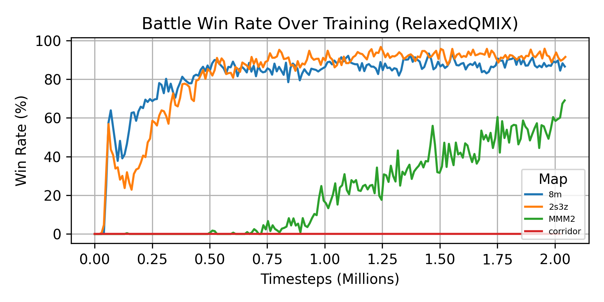
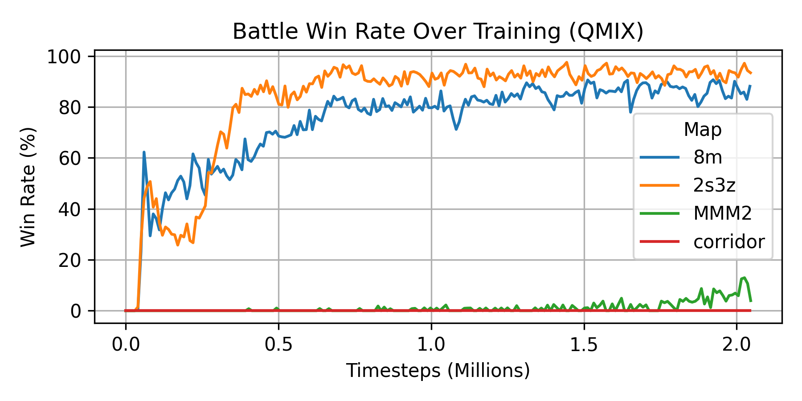

# 🌌 Relaxed QMIX: Enhanced Multi-Agent Reinforcement Learning

## The Challenge
Standard QMIX algorithms force strict monotonicity constraints, preventing AI agents from learning complex cooperative strategies like tactical retreats in StarCraft II battles. This limitation severely impacts performance in heterogeneous team compositions.

---

## My Solution
I designed and implemented **Relaxed QMIX**, extending the original algorithm with a correction network and regularization system. This allows agents to learn flexible coordination strategies while maintaining training stability.

**Key Innovation:** Added an ε-parameter to balance strict coordination rules with strategic flexibility, enabling richer team behaviors.
---

## Results That Matter
- **7x performance improvement** on complex maps (70% vs 10% win rate)
- Faster convergence on standard benchmarks while matching baseline performance
- Trained across 2M+ training timesteps on enterprise-grade GPU clusters

*A timestep is one agent-environment interaction cycle: agents observe, act, and receive feedback.

--- 

## See It in Action

**QMIX Training Run**

<iframe width="560" height="315" src="https://www.youtube.com/embed/_o91TFaJ-rg" title="QMIX Training Run" frameborder="0" allow="accelerometer; autoplay; clipboard-write; encrypted-media; gyroscope; picture-in-picture" allowfullscreen></iframe>

**RelaxedQMIX Training Run**

<iframe width="560" height="315" src="https://www.youtube.com/embed/To9-4rwUBhw" title="Relaxed QMIX Episode Highlight" frameborder="0" allow="accelerometer; autoplay; clipboard-write; encrypted-media; gyroscope; picture-in-picture" allowfullscreen></iframe>

---

## Technical Implementation
- **Framework:** PyMARL, PyTorch
- **Infrastructure:** SLURM cluster management, NVIDIA V100 GPUs
- **Scale:** Thousands of simulated battles across multiple StarCraft II scenarios

---

## 📄 Full Report  

For full methodology, complete diagnostics, and additional plots:  
💻 [GitHub Repository](https://github.com/miruyoun/PyMARL_RL_Project)  
📕 [Read Full Report (PDF)](assets/pymarl/RelaxedQMIX_Paper.pdf)  
🎥 [Full YouTube Playlist](https://www.youtube.com/playlist?list=PLfNwQXb-4EYiBC-Hm0P8xQDTPxbTGFpBp)

---

